# BRODALF

BRODALF keeps track of where every copy of your files lives. It is built for
backups on hard drives that spend most of their time unplugged in a drawer.

The catalog, a `.brodalf` file, holds no file data. It records every file and
folder you protect, every version BRODALF has seen, and every drive a copy of
each version was written to. In the app, files stay greyed out until BRODALF
can see a correct copy on storage that is connected right now.

See [docs/DESIGN.md](docs/DESIGN.md) for the design.

## Status

Version **0.4.0**, released 2026-10-07. The C core library, the Windows app
(`brodalf.exe`) and a command-line harness (`brodalf-cli`) work, with
optional encryption. Builds are on the
[Releases](https://github.com/Phawx/BRODALF/releases) page (a zip with the
two exes, no installer, unsigned, so SmartScreen warns). The Go files at the
top of the repo are the earlier prototype and are not part of the C build.

OneDrive and Dropbox storage was part of 0.3.0 and has been taken out for
now (see [Where the project stands](#where-the-project-stands)).

**0.3.0 was the first build tried on a real Windows PC** (2026-10-04): the
whole loop of scanning, backing up to a USB stick, checking, changing and
renaming files, keeping old versions and restoring worked first time. What
has still only run under Wine is listed under
[Where the project stands](#where-the-project-stands) at the end of this
file, with the open items and how to pick the work up.

## Build

You need CMake 3.16+ and a C compiler. Everything else is bundled in
`third_party/`.

```sh
cmake -S . -B build
cmake --build build --config Release
ctest --test-dir build -C Release
```

On Windows this works with Visual Studio (open the folder, or use the commands
above from a Developer Prompt) or MinGW-w64. To build a Windows `.exe` from
Linux:

```sh
cmake -S . -B build-win -DCMAKE_TOOLCHAIN_FILE=cmake/mingw-w64-x86_64.cmake
cmake --build build-win
```

## The Windows app

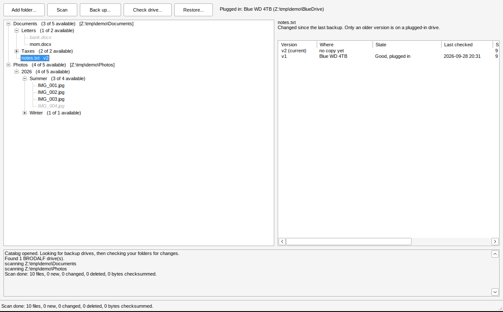

Run `brodalf.exe`, or double-click a `.brodalf` file after associating it.

1. Pick the last catalog, open another, or create a new one.
2. On a new catalog, choose the folders to protect.
3. BRODALF looks for its drives and scans your folders for changes.
4. The tree shows everything you protect. Greyed files have no copy on a drive
   that is plugged in (the label says which drive holds them, if any). Amber
   files have changed, and only an older version is reachable. Red means a
   copy is missing or damaged, and struck-through means deleted from your
   folder. Folders show how many files inside are available.
5. Select a file to see every version and where each copy is.
6. **Back up** copies what is missing to a plugged-in drive, or sets up a new
   one. **Check drive** re-reads every copy. **Restore** writes the selected
   file or folder back out. Plugging in a drive is noticed on its own.

Clicking a file shows what it is (size, modified time, checksum, how many
versions) and every drive that holds it: the drive's name, where it is kept,
when and where it was last plugged in, and what the disk said about itself.
That works just the same when none of those drives are plugged in, so you know
which box to go and get.

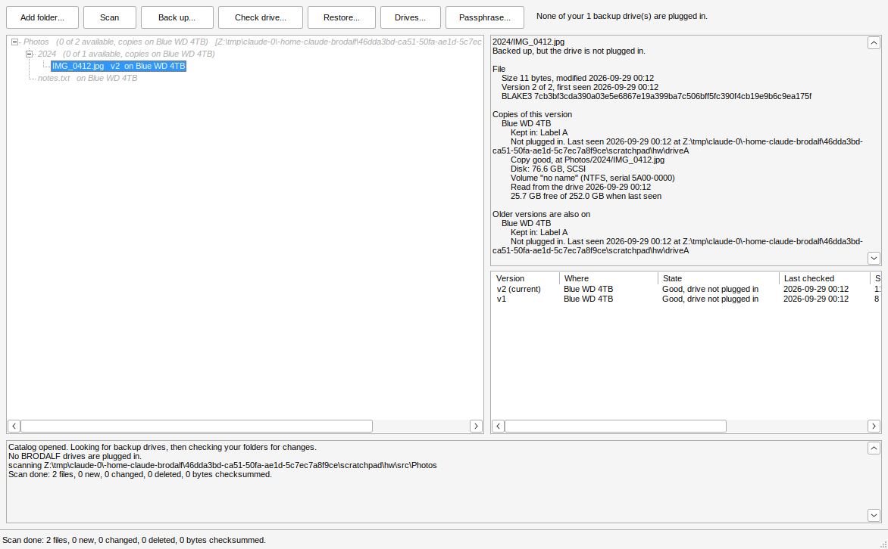

The **Local backups** menu lists every external or removable disk BRODALF
knows, plugged in or not, with how much room it had when last seen; each
disk has a submenu to back up to it, read back its copies, run a full check
or see its details, and below the disks are **Add an external or removable
disk...** and **What needs backing up, and which disk to plug in...**.

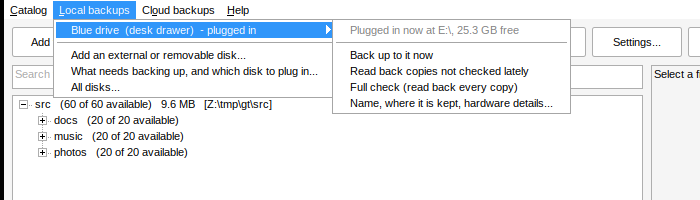

Above the log, a progress bar shows what BRODALF is doing right now: how
many files it has looked at, copied or read back out of how many, how much
data, the current data rate and the file it is on.

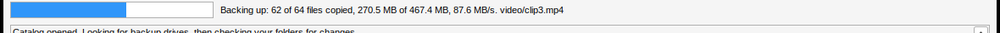

After a backup, everything on the drive lights up:

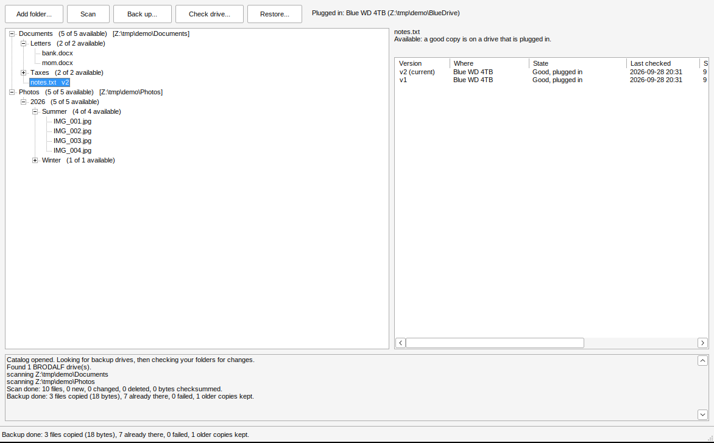

### Encrypted drives

When you set up a new drive, tick **Encrypt the files on this drive**. The
first time, BRODALF asks you to choose a passphrase. File contents on that
drive are encrypted (XChaCha20-Poly1305, key from Argon2id), while file and
folder names stay readable so you can still find things in Explorer. Encrypted
copies end in `.bdenc`. Each drive is plain or encrypted from the day it is
set up.

Under **Settings...** you can change the passphrase, encrypt the catalog
file itself (BRODALF then asks for the passphrase when it opens), or make
BRODALF forget the passphrase until it next needs it.

**Write the passphrase down somewhere safe.** Without it, nobody can read the
encrypted copies, including you.

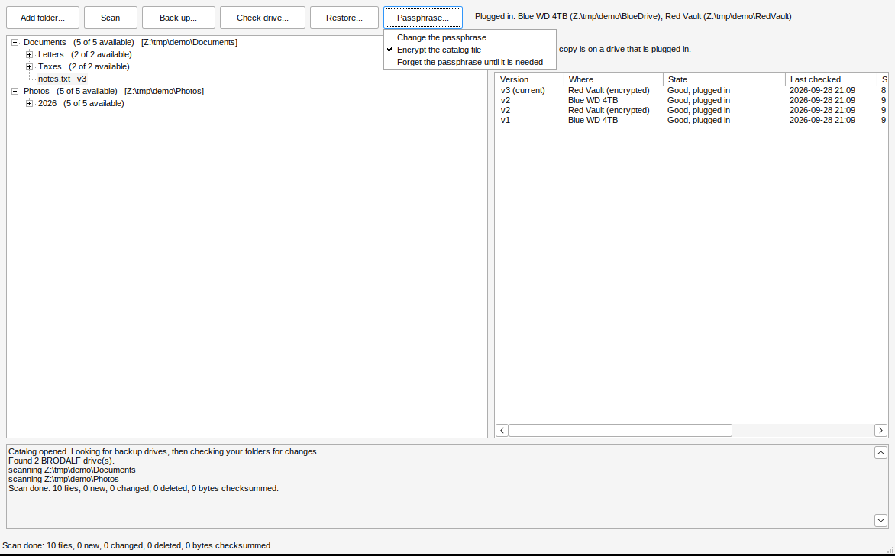

### Drives: identity, health and where they are kept

A drive is recognised by the `BRODALF.media` file on it, not by its letter.
Each time it is plugged in BRODALF also reads what the disk says about itself
and keeps the latest reading in the catalog:

- make, model, serial number, firmware, bus (USB, SATA, NVMe...) and size;
- the volume name, serial and file system;
- SMART health: the drive's own failure prediction, temperature, hours
  powered on, power cycles, reallocated/pending/unreadable sectors, and SSD
  wear. Internal SATA and NVMe drives answer without extra rights; some
  drives only answer when BRODALF runs as administrator, and many USB
  enclosures do not pass SMART through at all (BRODALF says which).

If the same drive ID ever turns up on a disk with a different serial number
(a copied or moved BRODALF folder), the log says so.

Every drive can also have a free-text **where it is kept** label, such as
"Label A" or "Box 3, garage shelf". Enter it when setting up a drive, or any
time from **Drives...**, which shows everything BRODALF knows about each
drive and lets you rename it.

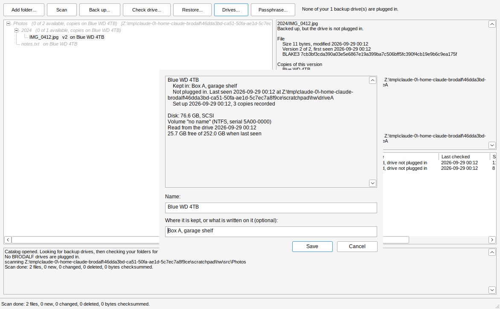

### Files at risk

BRODALF has a protection target: by default **2 copies of every file, in 2
different places**. A place is what a drive's "where it is kept" says (so
"Box A" and "Office shelf" are two places), and drives with no place set
count together as one. A copy counts when BRODALF last saw it good, whether
or not the drive is plugged in right now.

The **At risk** button shows how many files fall short. It opens a list of
those files, fewest copies first (a file changed since its last backup has
no copy of its new version), and a list of the drives that would help most,
with where each is kept. Double-click a plugged-in drive, or pick it and
press **Back up to it**, to fill the gap. The target can be changed in the
same window.

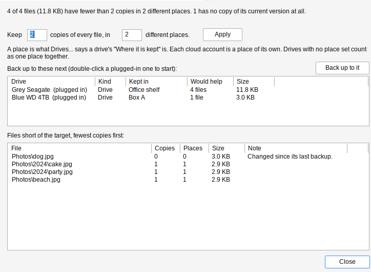

### Plug in to back up, and check reminders

When a backup drive is plugged in while BRODALF is open, it checks your
folders for changes and backs up to that drive on its own (it asks for the
passphrase first if the drive is encrypted). Turn this off under
**Settings > Back up as soon as a drive is plugged in**.

Copies sitting on a shelf can slowly go bad, so BRODALF keeps track of when
each drive's copies were last read back by a full check. When a drive's
oldest copy hasn't been read in 6 months, BRODALF lists it when it opens
and offers a full check when that drive is plugged in. Change how often (3
months, 6 months, a year, or never) under **Settings > Remind me to check
each drive**.

### Not running all the time

BRODALF does not sit in the background. Open it and it rescans your folders,
works out what needs backing up and reads back the copies on whatever is
plugged in; close it and nothing of it runs. Instead, Windows Task Scheduler
runs a quiet check once a day. BRODALF sets that up the moment a catalog is
created (daily at 12:00) and keeps it pointing at the copy of BRODALF you
ran; change it or turn it off under **Settings > Check my folders for
changes while BRODALF is closed** (every day, every week, or never). The
check rescans with no window and speaks up only when files fall short of
the target, with how much needs backing up and which disk to plug in. The
disk it names is one that had enough free space when it was last seen, so
you reach for a drive you already have rather than a new one.

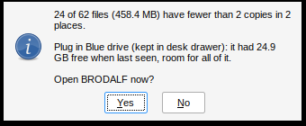

To know that, BRODALF records every drive's total and free space whenever
it is plugged in and before and after each backup. **Drives...** shows the
latest reading, and the **Free space** column of the at-risk view says
whether what is at risk would fit on each drive.

### Moved and renamed folders

Renaming or moving a folder used to mean copying all of it again. A scan
now recognises a file that disappeared in one place and turned up in
another by its checksum and size, and the next backup moves the copy on the
drive to the new name instead of copying it again. Folders that are left
empty on the drive go too. The ransomware guard (below) also knows a move
from damage, so renaming a big folder does not pause backups.

### Read back when plugged in

Checksums are what BRODALF trusts, not file names or dates. When a known
drive is plugged in (or is present when BRODALF opens), after the quick
check it reads back every copy on it that has not been read back in a
month and compares the checksum, so a copy going bad on the shelf shows up
as damaged while you can still replace it from your folder or another
drive. Change how often under **Settings > Read back copies when a drive is
plugged in** (a week, a month, 3 months, or never). A full check of every
copy is still one click away per drive.

### The ransomware guard

If one scan finds a quarter or more of your files (and at least 50) changed
or gone at once, BRODALF treats it as what ransomware encrypting a disk
looks like. It pauses backups, so the good copies on your drives are not
replaced by scrambled ones, stops cleaning up old versions, and asks what
happened:

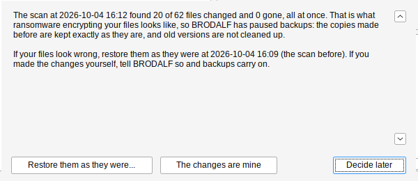

**Restore them as they were...** brings everything back as of the scan
before the changes; **The changes are mine** lets backups carry on (and
runs the one that was stopped). Pick the threshold, or turn the guard off,
under **Settings > Pause backups (ransomware guard)**. Separately,
**Catalog > Restore what is selected as it was on a date...** restores any
folder as it stood at the end of a chosen day, including files deleted
since.

### Files in use

A file another program holds open, such as Outlook's `.pst` or a running
database, cannot be read, so a scan skips it and lists it at the end.
BRODALF then offers to read such files from a Windows shadow copy: it asks
for administrator permission once, takes a snapshot of the volume, copies
just those files out of it and backs them up from there. The same offer is
under **Help > Read files that are in use from a shadow copy...**. This has
so far only been exercised under Wine, which has no shadow copy service, so
please report what it does on a real Windows PC.

### Search

Type in the box above the tree to find files and folders by name anywhere
in your protected folders (every word must match, so `party 2024` works).
Each result shows whether it is available and which drives hold it, with
where each drive is kept, even when none of them are plugged in. Click a
result to see its details; double-click it to go to it in the tree.

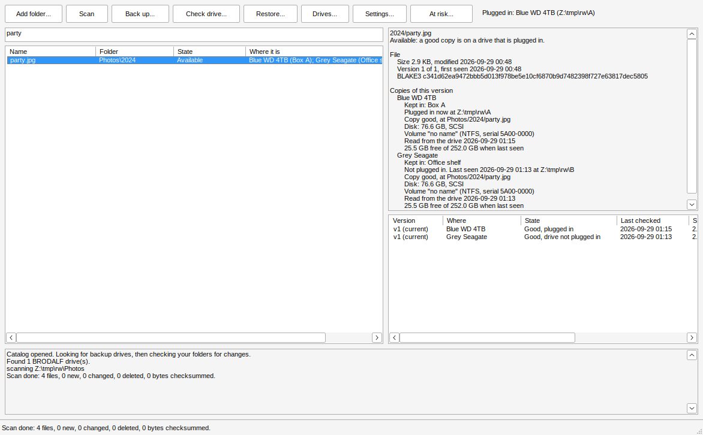

### Restoring a folder spread across drives

When you restore a folder whose files live on several drives, BRODALF first
shows which drives it needs, in order, with where each one is kept:
"1. Drive B (kept in Box 7), plugged in; 2. Drive A (kept in Box 3)". It
restores what the plugged-in drives hold right away, then restores each
other drive's part as soon as you plug it in (while BRODALF is open).
Files already in the destination with the right size and contents are
skipped, so an interrupted restore just picks up where it stopped.

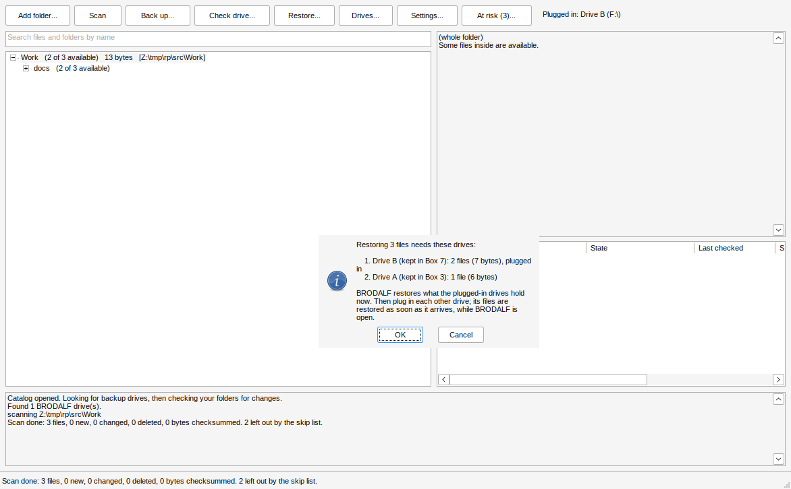

### When a drive fills up

A backup never fills a drive to the last byte (it leaves 16 MB, or 0.5% of
the drive, whichever is more). Files that don't fit are skipped and smaller
ones still go on. BRODALF then offers to put what didn't fit on another
plugged-in drive, or asks you to plug one in; that drive gets only the
files the full drive(s) couldn't take, so a big folder spreads across as
many drives as it needs. The tree shows how much space each protected
folder needs next to its name.

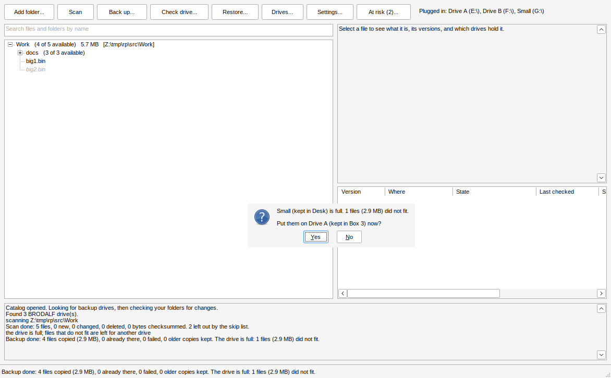

### What to leave out

Scans skip temp files, caches and things a program can rebuild, such as
`*.tmp`, `~$*` Office lock files, `Thumbs.db`, `$RECYCLE.BIN`,
`node_modules`, `__pycache__` and `.cache`. Change the list under
**Settings > What to leave out...**: one pattern per line, `*` and `?` as
wildcards, a trailing `/` for folders only, and a `/` in the middle (like
`Photos/Exports/`) for a path inside a protected folder. Files that are
left out and were never backed up drop out of the tree; ones that were
backed up show as deleted, and their copies stay.

### Folders in OneDrive or Dropbox

A protected folder can be inside OneDrive or Dropbox (on many PCs Windows
keeps Documents and Pictures in OneDrive). Their files carry a Windows
marker that looks like a shortcut's; BRODALF tells the two apart and scans
them like any other file. A file that is "online-only" is downloaded by
Windows when BRODALF reads it to checksum it, so the first scan of a large
online-only folder takes a while and uses disk space. Real shortcuts
(symbolic links and junctions) are left out of scans.

### Old versions

When a file changes, the previous copy moves into `.versions` on the drive.
By default each drive keeps the last 5 old versions of a file, and every
old version from the past year; anything older than both is removed at the
start of the next backup to that drive. Pick another rule under
**Settings > Old versions on each drive** (keep everything, last 10 or past
year, last 3 or past 3 months, or only the version before the current one).
The current version is never removed.

### When something goes wrong

BRODALF keeps a log in `%LOCALAPPDATA%\BRODALF\brodalf.log` (the older
part moves to `brodalf.log.old` past about 1 MB). When a job stops with an
error, the catalog cannot be saved or opened, or the app crashes, BRODALF
shows the error and saves a report to
`%LOCALAPPDATA%\BRODALF\reports\brodalf-error-<date>-<time>.txt`. The
report starts with instructions for posting it as a new issue at
https://github.com/Phawx/BRODALF/issues, then gives the error, the BRODALF
version and build, the Windows version and the end of the log. Your user
name, computer name, email addresses and sign-in tokens are replaced before
the file is written. Nothing is sent anywhere. The command line does the
same, printing where the report went.

## Try it from the command line

```sh
brodalf-cli new   family.brodalf
brodalf-cli add   family.brodalf "C:\Users\me\Pictures"
brodalf-cli scan  family.brodalf
brodalf-cli tree  family.brodalf                      # everything greyed out
brodalf-cli drive family.brodalf E:\ "Blue WD 4TB"
brodalf-cli backup family.brodalf E:\
brodalf-cli tree  family.brodalf --drive E:\          # backed-up files light up
brodalf-cli versions family.brodalf Pictures "2024/IMG_0412.jpg" --drive E:\
brodalf-cli check family.brodalf E:\ --full
brodalf-cli restore family.brodalf D:\restored --drive E:\

brodalf-cli drive family.brodalf F:\ "Red Vault" --encrypt --location "Label A"
brodalf-cli drives family.brodalf                            # make, model, serial, health, where kept
brodalf-cli drive-location family.brodalf "Red Vault" "Box 3, garage"
brodalf-cli encrypt-catalog family.brodalf on
brodalf-cli passphrase family.brodalf                        # change it

brodalf-cli target  family.brodalf 2 2                       # 2 copies of everything, in 2 places
brodalf-cli at-risk family.brodalf                           # what falls short, and which drive to plug in
brodalf-cli search  family.brodalf party 2024                # find a file and the drive (and box) holding it
brodalf-cli option  family.brodalf check_days 365            # remind to re-read each drive yearly

brodalf-cli restore-plan family.brodalf --source Pictures --dest D:\restored   # which drives, in which order
brodalf-cli backup family.brodalf G:\ --continue-from "Blue WD 4TB"  # only what did not fit on the full drive
brodalf-cli skip    family.brodalf --add "Downloads/"         # leave a folder out of scans
brodalf-cli option  family.brodalf keep_versions 3           # keep the last 3 old versions ...
brodalf-cli option  family.brodalf keep_days 90              # ... and anything from the past 90 days
brodalf-cli prune   family.brodalf E:\                        # apply that now (backups also do it)

brodalf-cli need    family.brodalf                           # what needs backing up, and the drive to plug in
brodalf-cli verify  family.brodalf E:\                        # read back copies not read back in 30 days
brodalf-cli option  family.brodalf verify_days 7             # ... make that a week
brodalf-cli guard   family.brodalf                           # why backups are paused (--clear: the changes were mine)
brodalf-cli backup  family.brodalf E:\ --anyway              # back up although the guard tripped
brodalf-cli restore family.brodalf D:\restored --as-of 2026-09-30 --drive E:\    # the files as they were that day
brodalf-cli restore family.brodalf D:\restored --as-of before-changes --drive E:\ # as before the guard tripped
brodalf-cli option  family.brodalf guard_percent 50          # pause only when half the files change at once
brodalf-cli option  family.brodalf schedule 7                # the Windows app checks weekly (1: daily, 0: never)
brodalf-cli shadow-copy C:\shadow "C:\Users\me\Outlook.pst"  # as administrator: copy an in-use file out of a shadow copy
```

Passphrases are asked for on the terminal, or read from `BRODALF_PASSPHRASE`
(and `BRODALF_NEW_PASSPHRASE` when setting one).

## Layout

| Path | What |
| --- | --- |
| `include/brodalf.h` | Public API of the core library |
| `src/catalog.c` | The `.brodalf` file format and schema |
| `src/scan.c` | Scanning source folders, versions, moves, the ransomware guard |
| `src/media.c` | Drive IDs, connecting drives, quick, full and read-back checks |
| `src/backup.c` | Backup with kept versions, restore |
| `src/crypto.c` | Passphrase, master key, encrypted file streams |
| `src/store*.c`, `src/store.h` | Storage interface: local drives and folders |
| `src/query.c` | Ghost-tree state for the GUI |
| `src/risk.c` | Files at risk, which drive would help, space tracking |
| `src/shadow.c` | Windows shadow copies for files in use |
| `src/drive_hw.c` | Disk make, model, serial and SMART health |
| `src/platform_*.c` | Windows and POSIX file system layer |
| `gui/` | The Win32 app, `brodalf.exe` |
| `cli/main.c` | `brodalf-cli` |
| `tests/test_core.c` | End-to-end test |
| `tests/test_crypto.c` | Encryption test |

## Third-party code

`third_party/` holds unmodified copies of
[SQLite](https://sqlite.org) 3.45.0 (public domain),
[BLAKE3](https://github.com/BLAKE3-team/BLAKE3) 1.5.4 (CC0 / Apache-2.0) and
[zstd](https://github.com/facebook/zstd) 1.5.6 (BSD, single-file build) and
[Monocypher](https://monocypher.org) 4.0.2 (CC0 / BSD-2-Clause).

## Where the project stands

This section is the hand-off: everything a person or a Claude Code session
on a local machine needs to pick the work up without the chat history.

### History

- The original BRODALF was a Rust tool (egui GUI, catalog in SQLite, BLAKE3
  hashes, copies to a local folder). It no longer compiled and had no cold
  storage, no versioning and no cloud. It was used as a reference only; the
  Rust source is not in this repo.
- Before that there was a Go/Fyne prototype. Its files (`main.go`, `go.mod`,
  `go.sum`) still sit at the top of the repo, untouched, and are not built.
- On 2026-09-28 the design below was agreed and the C rewrite started
  (plain C11 + CMake, vendored dependencies). It landed as PR #1 the same
  day; everything since has gone straight to `master`.
- v0.2.0 was released 2026-09-29, v0.3.0 on 2026-10-04.
- On 2026-10-04 the released 0.3.0 was run on a real Windows 11 PC for the
  first time, against a USB stick; see
  [What the first real-PC test showed](#what-the-first-real-pc-test-showed).
- v0.4.0 (2026-10-07) took the OneDrive and Dropbox storage out again and
  fixed the four bugs below that the code review and that test turned up.

### Design decisions (agreed 2026-09-28, still binding)

- **Not resident.** BRODALF never runs in the background. It runs when opened,
  and a Windows Task Scheduler job runs `brodalf.exe --check <catalog>`
  periodically to rescan, work out the space needed and name a known drive
  with enough free space. Free space per drive is recorded on plug-in and
  before and after every backup. A tray icon or always-on mode was rejected.
- **Checksums are the truth.** Whether data is safely held is decided by
  BLAKE3 checksums, everywhere: quick and full checks, read-back on plug-in,
  move and rename detection.
- **Offline removable drives.** A drive is identified by the
  `BRODALF.media` file on it, never by its letter.
- **No cloud storage for now** (owner's call, 2026-10-07). OneDrive and
  Dropbox as secondary storage were built in 0.3.0 (OAuth with PKCE, tokens
  in Windows Credential Manager, app-folder access, chunked uploads) and
  removed in 0.4.0. The code is in git history at tag `v0.3.0`:
  `src/cloud.c`, `src/http_*.c`, `src/secrets.c`, `tests/test_cloud.c`,
  `tests/mock_cloud.py` and the cJSON dependency. A catalog written by
  0.3.0 that lists a cloud account still opens: the account is shown as
  unsupported, nothing can be backed up to it, and the copies it holds
  still count towards the protection target as a place of their own.
- **The catalog holds no file data**, only where the bits live. Old versions
  stay browsable on the drive in a `.versions` folder.
- **Encryption is optional**, per drive, and encrypts file contents only.
  File and folder names stay readable so a drive is still browsable.
- **Windows is the platform, the GUI is the interface**: native Win32 in C,
  with a Local backups menu listing every known disk and a prominent
  progress area. POSIX builds exist for tests and the CLI.
- **Startup flow**: open BRODALF, pick or create a `.brodalf` file, connect
  everything reachable, pick folders, scan metadata and checksums, show the
  ghost tree greyed out until a copy is verified on connected storage.
  Clicking an entry shows its details in a second pane.
- **A copy of the catalog goes onto each drive** at the end of every backup
  to it (`catalog-backup.brodalf`).
- **Ransomware**: on a mass change, pause backups and steer toward restoring,
  not backing up.

The original design write-up lives at
https://claude.ai/artifact/RMxcPVGY6unWn917nXnJ8w, but everything that
matters from it is in this section and in [docs/DESIGN.md](docs/DESIGN.md),
which describes the current implementation.

### How it is built and tested

- `cmake -S . -B build && cmake --build build && ctest --test-dir build`.
  Tests: `tests/test_core.c` (end to end, including the bit-rot and
  at-risk cases added in 0.4.0) and `tests/test_crypto.c` (about 50 s
  under ASan because of Argon2, 2 s in Release).
- CI is `.github/workflows/c-core.yml`: builds and tests on ubuntu-latest
  and windows-latest (MSVC), uploads `brodalf.exe` and `brodalf-cli.exe` as
  the `brodalf-windows` artifact.
- Until 0.3.0, Windows testing was done from Linux: cross-compile with
  `cmake/mingw-w64-x86_64.cmake` (`gcc-mingw-w64-x86-64`) and run under
  `wine64` with `LANG=C.UTF-8`; GUI screenshots were taken with Xvfb,
  xdotool and ImageMagick. Note that the released zip is the MSVC build
  from CI, not the MinGW build that ran under Wine. Wine has no VSS, a stub
  `schtasks`, no real disk model or SMART data and no real plug-in
  notifications.
- Vendored in `third_party/`: SQLite 3.45.0, BLAKE3 1.5.4, zstd 1.5.6
  (single file) and Monocypher 4.0.2. Nothing is downloaded at build time.

### Releasing

CI publishes a release on every push to `master` whose `project(... VERSION
x.y.z)` in `CMakeLists.txt` has no release yet, as `vx.y.z`, with the zip of
the two exes plus this README and the notes from `.github/release-notes.md`.
To ship: bump the version in `CMakeLists.txt`, update the release notes,
push to `master`. The exes are unsigned.

### What the first real-PC test showed

On 2026-10-04 the released 0.3.0 was run on a Windows 11 laptop with a
29 GB SanDisk USB stick (FAT32) as the drive, the protected folder inside
OneDrive, 13 bogus files (5.6 MB) with a `.tmp`, an empty file, a one-byte
file and an accented name among them. Everything in the loop worked first
time and no error report was produced:

- scan (12 files, the `.tmp` left out, nothing skipped as a link);
- setting up the drive and backing up (12 copies, all identical to the
  originals by SHA-256; `BRODALF.media` and `catalog-backup.brodalf` on
  the stick);
- the file details and **Drives...** with the real hardware: make, model,
  serial, firmware, bus, volume, free space and the "does not pass SMART
  through" note;
- a full check (12 good); editing, renaming and removing files, then
  backing up again (the old version under `.versions`, the renamed file
  moved on the drive instead of copied, the removed file kept);
- restoring the folder (identical to the source);
- the **At risk** window; closing (catalog saved, lock released).

Also seen: creating a catalog registers the Task Scheduler job straight
away (`schtasks /Create ... -> 0` in the log), and the first launch had
been left at the catalog chooser while a second was started, so two
instances ran at once (the lock file kept them apart). The four bugs fixed
in 0.4.0 came from the code review of the same day and this test:

1. OneDrive and Dropbox placeholder files carry the reparse-point
   attribute, and the scanner treated every reparse point as a link to
   skip (`src/platform_win32.c`). It did not bite in the test because the
   files were freshly created, but a synced folder could have gone
   entirely unprotected. Only name-surrogate reparse points (symbolic
   links, junctions) are links now.
2. A copy found damaged by a full check was marked good again by the next
   quick check when its size and time had not changed, which is what bit
   rot looks like (`src/media.c`). A copy found missing or damaged now
   stays so until a re-read matches its hash.
3. The shadow-copy helper (`brodalf.exe --shadow-copy`) was started after
   the GUI's `CoInitializeEx(COINIT_APARTMENTTHREADED)`, so VSS ran in a
   single-threaded apartment with a blocking wait, the classic hang. The
   helper now runs before COM is initialised (`gui/main.c`).
4. The **At risk** list said "changed since its last backup" for a file
   whose newest version was already backed up (`src/risk.c`).

### Open items: what still needs trying on a real Windows PC

1. The scheduled check: registering the task works (exit code 0 on real
   Windows). Still to see: `brodalf.exe --check <catalog>` actually
   running at 12:00 and popping its one message when files are at risk.
   Note that `schtasks` creates tasks with "do not start on battery" by
   default, so a laptop on battery may never run it.
2. Files in use: the shadow-copy offer, the single UAC prompt, and whether
   an open `.pst` actually gets read and backed up (`src/shadow.c`). Try
   `brodalf-cli shadow-copy` from an elevated prompt first.
3. Plugging in a known disk while BRODALF is open: the device-change
   notification should quick check it, then (as the code is written) read
   back copies older than a month, scan, and back up. The test had the
   stick plugged in before launch, so this never fired.
4. **Drives...** with internal disks: SMART from NVMe and SATA, the admin
   fallback (whose reading is currently replaced by the next unprivileged
   one), and RAID-mode laptops. The USB stick path is confirmed.

### Known issues from the 2026-10-04 code review, not yet fixed

- No way to cancel a running job; Close is refused while one runs.
- The GUI clears "busy" before showing the end-of-job prompts, so a drive
  plugged in during a prompt can start a worker while the UI still uses
  the catalog; typing in the search box also queries the catalog during a
  job.
- Two instances can open the same catalog if the user agrees to remove a
  stale lock; a named mutex would be safer.
- The elevated shadow-copy helper trusts a user-writable list file in
  `%TEMP%`; it should check the paths against the protected folders and
  write into a folder only administrators can change.
- `bd_random_bytes` failures are ignored where the master key, salts and
  nonces are drawn (`src/crypto.c`), and the Argon2 parameters read from
  a catalog header are not bounded.
- `src/drive_hw.c`: the temperature property id is 55 but should be 52,
  and the ATA attribute table is parsed from NVMe/SCSI answers too.
- Copies and restored files get the backup time as their modified time,
  not the original file's.
- Paths are compared case-sensitively although NTFS is not; a source
  folder literally named `.versions` would collide with the versions tree.
- The release zip has no LICENSE or third-party notices (zstd's and
  SQLite's terms allow it, but BSD and CC0 notices belong in the zip).
- `DESIGN.md` said schema 4; the code is at 5 (fixed in the doc).

### Backlog: suggested but not yet asked for

Ideas offered to the owner and not picked up. Pick by number.

1. Recovery on a new PC: open a catalog from the copy on a drive and
   rebuild the picture from the drives themselves.
2. A printable recovery key for the encryption passphrase.
3. A deleted-files view.
4. Replace a drive: retire a failing drive and refill another with what it
   held.
5. A printable drive list (name, where kept, what is on it).
6. An installer.
7. Code signing, so SmartScreen stops warning.
8. An update check.
9. Cloud storage again (OneDrive, Dropbox), starting from the 0.3.0 code
   in git history. Before bringing it back: a Microsoft Entra app
   registration, listing-based quick checks instead of one request per
   copy, local `quickXorHash` and Dropbox `content_hash` so uploads are
   verified, and resumable chunked uploads.

Rejected: a tray icon or always-on mode (periodic runs only).

### Working conventions

- Commit straight to `master`; no long-lived branches, no PRs needed.
  Build and run the tests before pushing and keep CI green.
- Bump the version and ship a release when a batch of work is done.
- Write user-facing text (menus, dialogs, this README) in plain language,
  no jargon; the user of the app is not a developer.
- Say plainly in notes and release text what has only been exercised under
  Wine.
