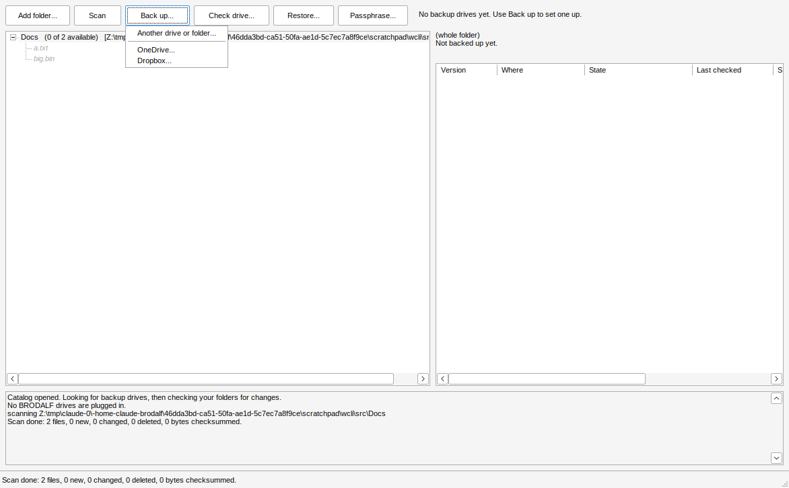

# BRODALF

BRODALF keeps track of where every copy of your files lives. It is built for
backups on hard drives that spend most of their time unplugged in a drawer,
and on OneDrive and Dropbox.

The catalog, a `.brodalf` file, holds no file data. It records every file and
folder you protect, every version BRODALF has seen, and every drive a copy of
each version was written to. In the app, files stay greyed out until BRODALF
can see a correct copy on storage that is connected right now.

See [docs/DESIGN.md](docs/DESIGN.md) for the design.

## Status

The C core library, the Windows app (`brodalf.exe`) and a command-line
harness (`brodalf-cli`) work, with optional encryption and OneDrive and
Dropbox as storage. Builds are on the
[Releases](https://github.com/Phawx/BRODALF/releases) page. The Go files
at the top of the repo are the earlier prototype and are not part of the C
build.

## Build

You need CMake 3.16+ and a C compiler. Everything else is bundled in
`third_party/`.

```sh
cmake -S . -B build
cmake --build build --config Release
ctest --test-dir build -C Release
```

On Windows this works with Visual Studio (open the folder, or use the commands
above from a Developer Prompt) or MinGW-w64. To build a Windows `.exe` from
Linux:

```sh
cmake -S . -B build-win -DCMAKE_TOOLCHAIN_FILE=cmake/mingw-w64-x86_64.cmake
cmake --build build-win
```

## The Windows app


Run `brodalf.exe`, or double-click a `.brodalf` file after associating it.

1. Pick the last catalog, open another, or create a new one.
2. On a new catalog, choose the folders to protect.
3. BRODALF looks for its drives and scans your folders for changes.
4. The tree shows everything you protect. Greyed files have no copy on a drive
   that is plugged in (the label says which drive holds them, if any). Amber
   files have changed, and only an older version is reachable. Red means a
   copy is missing or damaged, and struck-through means deleted from your
   folder. Folders show how many files inside are available.
5. Select a file to see every version and where each copy is.
6. **Back up** copies what is missing to a plugged-in drive, or sets up a new
   one. **Check drive** re-reads every copy. **Restore** writes the selected
   file or folder back out. Plugging in a drive is noticed on its own.

Clicking a file shows what it is (size, modified time, checksum, how many
versions) and every drive that holds it: the drive's name, where it is kept,
when and where it was last plugged in, and what the disk said about itself.
That works just the same when none of those drives are plugged in, so you know
which box to go and get.


The menu bar keeps the two kinds of storage apart. **Local backups** lists
every external or removable disk BRODALF knows, plugged in or not, with how
much room it had when last seen; each disk has a submenu to back up to it,
read back its copies, run a full check or see its details, and below the
disks are **Add an external or removable disk...** and **What needs backing
up, and which disk to plug in...**. **Cloud backups** lists the active
OneDrive and Dropbox connections, with adding and signing out.


Above the log, a progress bar shows what BRODALF is doing right now: how
many files it has looked at, copied or read back out of how many, how much
data, the current data rate and the file it is on.


After a backup, everything on the drive lights up:


### Encrypted drives

When you set up a new drive, tick **Encrypt the files on this drive**. The
first time, BRODALF asks you to choose a passphrase. File contents on that
drive are encrypted (XChaCha20-Poly1305, key from Argon2id), while file and
folder names stay readable so you can still find things in Explorer. Encrypted
copies end in `.bdenc`. Each drive is plain or encrypted from the day it is
set up.

The **Passphrase** button lets you change the passphrase, encrypt the catalog
file itself (BRODALF then asks for the passphrase when it opens), or make
BRODALF forget the passphrase until it next needs it.

**Write the passphrase down somewhere safe.** Without it, nobody can read the
encrypted copies, including you.


### Drives: identity, health and where they are kept

A drive is recognised by the `BRODALF.media` file on it, not by its letter.
Each time it is plugged in BRODALF also reads what the disk says about itself
and keeps the latest reading in the catalog:

- make, model, serial number, firmware, bus (USB, SATA, NVMe...) and size;
- the volume name, serial and file system;
- SMART health: the drive's own failure prediction, temperature, hours
  powered on, power cycles, reallocated/pending/unreadable sectors, and SSD
  wear. Internal SATA and NVMe drives answer without extra rights; some
  drives need BRODALF to be run as administrator once, and many USB
  enclosures do not pass SMART through at all (BRODALF says which).

If the same drive ID ever turns up on a disk with a different serial number
(a copied or moved BRODALF folder), the log says so.

Every drive can also have a free-text **where it is kept** label, such as
"Label A" or "Box 3, garage shelf". Enter it when setting up a drive, or any
time from **Drives...**, which shows everything BRODALF knows about each
drive and lets you rename it.


### Files at risk

BRODALF has a protection target: by default **2 copies of every file, in 2
different places**. A place is what a drive's "where it is kept" says (so
"Box A" and "Office shelf" are two places), every cloud account is a place
of its own, and drives with no place set count together as one. A copy
counts when BRODALF last saw it good, whether or not the drive is plugged in
right now.

The **At risk** button shows how many files fall short. It opens a list of
those files, fewest copies first (a file changed since its last backup has
no copy of its new version), and a list of the drives that would help most,
with where each is kept. Double-click a plugged-in drive, or pick it and
press **Back up to it**, to fill the gap. The target can be changed in the
same window.


### Plug in to back up, and check reminders

When a backup drive is plugged in while BRODALF is open, it checks your
folders for changes and backs up to that drive on its own (it asks for the
passphrase first if the drive is encrypted). Turn this off under
**Settings > Back up as soon as a drive is plugged in**.

Copies sitting on a shelf can slowly go bad, so BRODALF keeps track of when
each drive's copies were last read back by a full check. When a drive's
oldest copy hasn't been read in 6 months, BRODALF lists it when it opens
and offers a full check when that drive is plugged in. Change how often (3
months, 6 months, a year, or never) under **Settings > Remind me to check
each drive**.

### Not running all the time

BRODALF does not sit in the background. Open it and it rescans your folders,
works out what needs backing up and reads back the copies on whatever is
plugged in; close it and nothing of it runs. Instead, Windows Task Scheduler
runs a quiet check once a day (**Settings > Check my folders for changes
while BRODALF is closed**: every day, every week, or never). The check
rescans with no window and speaks up only when files fall short of the
target, with how much needs backing up and which disk to plug in. The disk
it names is one that had enough free space when it was last seen, so you
reach for a drive you already have rather than a new one.


To know that, BRODALF records every drive's total and free space whenever
it is plugged in and before and after each backup. **Drives...** shows the
latest reading, and the **Free space** column of the at-risk view says
whether what is at risk would fit on each drive.

### Moved and renamed folders

Renaming or moving a folder used to mean copying all of it again. A scan
now recognises a file that disappeared in one place and turned up in
another by its checksum and size, and the next backup moves the copy on the
drive to the new name instead of copying it again. Folders that are left
empty on the drive go too. The ransomware guard (below) also knows a move
from damage, so renaming a big folder does not pause backups.

### Read back when plugged in

Checksums are what BRODALF trusts, not file names or dates. When a known
drive is plugged in (or is present when BRODALF opens), after the quick
check it reads back every copy on it that has not been read back in a
month and compares the checksum, so a copy going bad on the shelf shows up
as damaged while you can still replace it from your folder or another
drive. Change how often under **Settings > Read back copies when a drive is
plugged in** (a week, a month, 3 months, or never). A full check of every
copy is still one click away per drive.

### The ransomware guard

If one scan finds a quarter or more of your files (and at least 50) changed
or gone at once, BRODALF treats it as what ransomware encrypting a disk
looks like. It pauses backups, so the good copies on your drives are not
replaced by scrambled ones, stops cleaning up old versions, and asks what
happened:


**Restore them as they were...** brings everything back as of the scan
before the changes; **The changes are mine** lets backups carry on (and
runs the one that was stopped). Pick the threshold, or turn the guard off,
under **Settings > Pause backups (ransomware guard)**. Separately,
**Catalog > Restore what is selected as it was on a date...** restores any
folder as it stood at the end of a chosen day, including files deleted
since.

### Files in use

A file another program holds open, such as Outlook's `.pst` or a running
database, cannot be read, so a scan skips it and lists it at the end.
BRODALF then offers to read such files from a Windows shadow copy: it asks
for administrator permission once, takes a snapshot of the volume, copies
just those files out of it and backs them up from there. The same offer is
under **Help > Read files that are in use from a shadow copy...**. This has
so far only been exercised under Wine, which has no shadow copy service, so
please report what it does on a real Windows PC.

### Search

Type in the box above the tree to find files and folders by name anywhere
in your protected folders (every word must match, so `party 2024` works).
Each result shows whether it is available and which drives hold it, with
where each drive is kept, even when none of them are plugged in. Click a
result to see its details; double-click it to go to it in the tree.


### Restoring a folder spread across drives

When you restore a folder whose files live on several drives, BRODALF first
shows which drives it needs, in order, with where each one is kept:
"1. Drive B (kept in Box 7), plugged in; 2. Drive A (kept in Box 3)". It
restores what the plugged-in drives hold right away, then restores each
other drive's part as soon as you plug it in (while BRODALF is open).
Files already in the destination with the right size and contents are
skipped, so an interrupted restore just picks up where it stopped.


### When a drive fills up

A backup never fills a drive to the last byte (it leaves 16 MB, or 0.5% of
the drive, whichever is more). Files that don't fit are skipped and smaller
ones still go on. BRODALF then offers to put what didn't fit on another
plugged-in drive, or asks you to plug one in; that drive gets only the
files the full drive(s) couldn't take, so a big folder spreads across as
many drives as it needs. The tree shows how much space each protected
folder needs next to its name.


### What to leave out

Scans skip temp files, caches and things a program can rebuild, such as
`*.tmp`, `~$*` Office lock files, `Thumbs.db`, `$RECYCLE.BIN`,
`node_modules`, `__pycache__` and `.cache`. Change the list under
**Settings > What to leave out...**: one pattern per line, `*` and `?` as
wildcards, a trailing `/` for folders only, and a `/` in the middle (like
`Photos/Exports/`) for a path inside a protected folder. Files that are
left out and were never backed up drop out of the tree; ones that were
backed up show as deleted, and their copies stay.

### Old versions

When a file changes, the previous copy moves into `.versions` on the drive.
By default each drive keeps the last 5 old versions of a file, and every
old version from the past year; anything older than both is removed at the
start of the next backup to that drive. Pick another rule under
**Settings > Old versions on each drive** (keep everything, last 10 or past
year, last 3 or past 3 months, or only the version before the current one).
The current version is never removed.

### OneDrive and Dropbox

**Back up** also offers **OneDrive...** and **Dropbox...**. Name the storage,
optionally tick encryption, and your browser opens to sign in. BRODALF only
gets its own app folder (`Apps/BRODALF`) and cannot see anything else in the
account. The sign-in is saved in Windows Credential Manager, so the account
reconnects by itself whenever BRODALF opens; the catalog records only the
provider, the account name and where the saved sign-in is. From then on the
account works like a drive that is always plugged in: backups, `.versions`,
checks (quick checks compare the provider's own content hash, full checks
download and verify) and restores.

Every time the catalog is saved, a copy of it also goes to every connected
cloud account (`BRODALF/<catalog id>/catalog-backup.brodalf`), encrypted if
the catalog or that storage is.



To sign in again after a sign-in expires, choose the same provider again and
sign in with the same account; BRODALF recognises it and keeps its copies.

### App registrations

The app IDs are not in the source. CI builds the released `brodalf.exe` with
the repository's Actions variables `BRODALF_DROPBOX_CLIENT_ID` and
`BRODALF_ONEDRIVE_CLIENT_ID`; a build without them says "this build of BRODALF
has no ... app ID yet" for that service. For your own build, pass
`-DBRODALF_DROPBOX_CLIENT_ID=...` (and the OneDrive one) to CMake, or set
environment variables of the same names before running BRODALF. These IDs are
not secrets: sign-in uses PKCE, so no client
secret ships with BRODALF.

- **Microsoft Entra**: an app for personal and work accounts, platform
  "Mobile and desktop applications" with redirect URI `http://localhost`,
  delegated permissions `Files.ReadWrite.AppFolder` and `User.Read`.
- **Dropbox**: "App folder" access, redirect URI `http://localhost:53682/`,
  permissions `files.content.read/write`, `files.metadata.read/write`,
  `account_info.read`.

### When something goes wrong

BRODALF keeps a log in `%LOCALAPPDATA%\BRODALF\brodalf.log` (the older
part moves to `brodalf.log.old` past about 1 MB). When a job stops with an
error, the catalog cannot be saved or opened, or the app crashes, BRODALF
shows the error and saves a report to
`%LOCALAPPDATA%\BRODALF\reports\brodalf-error-<date>-<time>.txt`. The
report starts with instructions for posting it as a new issue at
https://github.com/Phawx/BRODALF/issues, then gives the error, the BRODALF
version and build, the Windows version and the end of the log. Your user
name, computer name, email addresses and sign-in tokens are replaced before
the file is written. Nothing is sent anywhere. The command line does the
same, printing where the report went.

## Try it from the command line

```sh
brodalf-cli new   family.brodalf
brodalf-cli add   family.brodalf "C:\Users\me\Pictures"
brodalf-cli scan  family.brodalf
brodalf-cli tree  family.brodalf                      # everything greyed out
brodalf-cli drive family.brodalf E:\ "Blue WD 4TB"
brodalf-cli backup family.brodalf E:\
brodalf-cli tree  family.brodalf --drive E:\          # backed-up files light up
brodalf-cli versions family.brodalf Pictures "2024/IMG_0412.jpg" --drive E:\
brodalf-cli check family.brodalf E:\ --full
brodalf-cli restore family.brodalf D:\restored --drive E:\

brodalf-cli drive family.brodalf F:\ "Red Vault" --encrypt --location "Label A"
brodalf-cli drives family.brodalf                            # make, model, serial, health, where kept
brodalf-cli drive-location family.brodalf "Red Vault" "Box 3, garage"
brodalf-cli encrypt-catalog family.brodalf on
brodalf-cli passphrase family.brodalf                        # change it

brodalf-cli target  family.brodalf 2 2                       # 2 copies of everything, in 2 places
brodalf-cli at-risk family.brodalf                           # what falls short, and which drive to plug in
brodalf-cli search  family.brodalf party 2024                # find a file and the drive (and box) holding it
brodalf-cli option  family.brodalf check_days 365            # remind to re-read each drive yearly

brodalf-cli restore-plan family.brodalf --source Pictures --dest D:\restored   # which drives, in which order
brodalf-cli backup family.brodalf G:\ --continue-from "Blue WD 4TB"  # only what did not fit on the full drive
brodalf-cli skip    family.brodalf --add "Downloads/"         # leave a folder out of scans
brodalf-cli option  family.brodalf keep_versions 3           # keep the last 3 old versions ...
brodalf-cli option  family.brodalf keep_days 90              # ... and anything from the past 90 days
brodalf-cli prune   family.brodalf E:\                        # apply that now (backups also do it)

brodalf-cli need    family.brodalf                           # what needs backing up, and the drive to plug in
brodalf-cli verify  family.brodalf E:\                        # read back copies not read back in 30 days
brodalf-cli option  family.brodalf verify_days 7             # ... make that a week
brodalf-cli guard   family.brodalf                           # why backups are paused (--clear: the changes were mine)
brodalf-cli backup  family.brodalf E:\ --anyway              # back up although the guard tripped
brodalf-cli restore family.brodalf D:\restored --as-of 2026-09-30 --drive E:\    # the files as they were that day
brodalf-cli restore family.brodalf D:\restored --as-of before-changes --drive E:\ # as before the guard tripped
brodalf-cli option  family.brodalf guard_percent 50          # pause only when half the files change at once
brodalf-cli option  family.brodalf schedule 7                # the Windows app checks weekly (1: daily, 0: never)
brodalf-cli shadow-copy C:\shadow "C:\Users\me\Outlook.pst"  # as administrator: copy an in-use file out of a shadow copy

brodalf-cli cloud-add family.brodalf dropbox "Dropbox"       # opens the browser to sign in
brodalf-cli backup family.brodalf cloud:Dropbox
brodalf-cli restore family.brodalf D:\restored --drive cloud:Dropbox
brodalf-cli cloud-signout family.brodalf Dropbox
```

Passphrases are asked for on the terminal, or read from `BRODALF_PASSPHRASE`
(and `BRODALF_NEW_PASSPHRASE` when setting one).

## Layout

| Path | What |
| --- | --- |
| `include/brodalf.h` | Public API of the core library |
| `src/catalog.c` | The `.brodalf` file format and schema |
| `src/scan.c` | Scanning source folders, versions, moves, the ransomware guard |
| `src/media.c` | Drive IDs, connecting drives, quick, full and read-back checks |
| `src/backup.c` | Backup with kept versions, restore |
| `src/crypto.c` | Passphrase, master key, encrypted file streams |
| `src/store*.c`, `src/store.h` | Storage interface: local drives and folders |
| `src/cloud.c` | OneDrive and Dropbox: sign-in, uploads, checks |
| `src/http_*.c`, `src/secrets.c` | WinHTTP client, sign-in redirect, Credential Manager |
| `src/query.c` | Ghost-tree state for the GUI |
| `src/risk.c` | Files at risk, which drive would help, space tracking |
| `src/shadow.c` | Windows shadow copies for files in use |
| `src/drive_hw.c` | Disk make, model, serial and SMART health |
| `src/platform_*.c` | Windows and POSIX file system layer |
| `gui/` | The Win32 app, `brodalf.exe` |
| `cli/main.c` | `brodalf-cli` |
| `tests/test_core.c` | End-to-end test |
| `tests/test_cloud.c`, `tests/mock_cloud.py` | Cloud test against a local mock of OneDrive and Dropbox |

## Third-party code

`third_party/` holds unmodified copies of
[SQLite](https://sqlite.org) 3.45.0 (public domain),
[BLAKE3](https://github.com/BLAKE3-team/BLAKE3) 1.5.4 (CC0 / Apache-2.0) and
[zstd](https://github.com/facebook/zstd) 1.5.6 (BSD, single-file build) and
[Monocypher](https://monocypher.org) 4.0.2 (CC0 / BSD-2-Clause).
